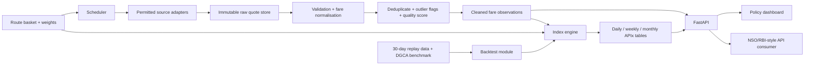

# SIH 2026 PS 56 — Real-time Airfare Price Index (APIx)

## The goal

Build a credible, policy-grade prototype that measures the fares an Indian consumer sees online, converts them into transparent route-level and headline indices, and exposes them through a dashboard and API for NSO/RBI-style users.

**Winning positioning:** this is not “a fare scraper with charts.” It is a *governed statistical measurement system* that makes online airfare prices usable as a CPI input. Every number should be traceable to a collection time, source, route, travel date, fare definition, cleaning decision, and index weight.

## Non-negotiable truth and strategy

No plan can guarantee winning a competitive hackathon. This plan maximises controllable factors: a working end-to-end demo, a defensible methodology, transparent limitations, strong compliance, reproducible evidence, and a clear public-policy story.

Never claim that the platform bypasses CAPTCHA, defeats bot protection, rotates IPs to evade controls, or scrapes sites contrary to their terms. That is legally and ethically risky and can damage the team’s credibility with government judges. Design for permitted public/API access, site terms, robots rules, rate limiting, cached requests, and data-provider partnerships. When a live source is unavailable, the product must still work with versioned approved fixture/synthetic data and be explicit about the data mode.

---

# 1. What you are actually building

## 1.1 Product statement

> **APIx is a high-frequency supplementary airfare-price measurement platform.** It samples a fixed basket of major domestic routes and booking horizons, normalises consumer-facing airfare quotes, applies documented quality rules and route weights, and publishes daily, weekly and monthly price indices with coverage indicators.

## 1.2 In-scope prototype

1. A fixed, documented basket of high-traffic domestic directional routes.
2. Fare collection interface with at least two permitted/live integrations where allowed, plus a deterministic replay/demo source.
3. Search dates at T+1, T+7, T+15, T+30 and T+45.
4. Immutable raw-quote store and cleaned quote table.
5. Robust cleaning, deduplication, outlier flagging and missing-data handling.
6. Daily, weekly and monthly APIx calculations at headline, route and lead-time levels.
7. FastAPI endpoints, dashboard, automated tests, Docker startup and methodology documentation.
8. A 30-day *reproducible* backtest/replay and an honest comparison with a suitable public DGCA benchmark.

## 1.3 Explicitly out of scope for the hackathon

- All airlines and OTAs in production at once.
- Circumventing access controls, CAPTCHAs, rate limits or terms.
- Claiming official CPI replacement status.
- Real-time tick-by-tick prices; a scheduled high-frequency sample is enough.
- Perfect historical replication of a DGCA series with a different fare definition.

## 1.4 Success criteria

| Area | Demo acceptance criterion |
|---|---|
| End-to-end flow | One command loads demo data, runs cleaning and index calculation, then opens API/dashboard. |
| Statistical clarity | A judge can trace headline APIx → route index → cleaned quote → raw record and see every rule. |
| Coverage | At least 10 directional routes × 5 lead-time windows; show actual route/quote coverage. |
| Reliability | The deterministic demo succeeds offline; live collectors fail safely and visibly. |
| Compliance | Data governance page clearly states permitted-source approach, rate limits and limitations. |
| Validation | 30 daily dated snapshots are replayable; comparison methodology and results are documented. |
| Usability | A non-technical policymaker understands the index movement, route heatmap and booking-horizon effect in 90 seconds. |

---

# 2. Architecture and data flow



## 2.1 Architecture decisions

| Layer | Choice | Why |
|---|---|---|
| Monorepo | pnpm workspaces + Turborepo or simple `Makefile` | One PR can update shared schema, API and dashboard safely. |
| Collectors | Python 3.12, Playwright, Pydantic | Good for browser-rendered permitted pages and strict data contracts. |
| Processing | Python, Polars/Pandas, SQLAlchemy | Fast prototype analytics and reproducible transformations. |
| Store | PostgreSQL + local/MinIO raw object storage | Relational index data plus immutable evidence. |
| Backend | FastAPI + OpenAPI | Typed, documented endpoints for dashboard and institutional consumers. |
| Frontend | Next.js/React + TypeScript + Recharts/Plotly | Fast filters, charts and polished user experience. |
| Orchestration | APScheduler first; Prefect optional | Avoid needless platform complexity in a hackathon. |
| Packaging | Docker Compose | Predictable judging-environment setup. |
| Tests | Pytest + Playwright/React tests + GitHub Actions | Demonstrates engineering maturity. |

## 2.2 Monorepo layout

```text
airfare-apix/
├── apps/
│   ├── api/                       # FastAPI service
│   ├── dashboard/                 # Next.js dashboard
│   └── scheduler/                 # Collection and recomputation jobs
├── packages/
│   ├── contracts/                 # Pydantic + JSON Schema + OpenAPI types
│   ├── collector-core/            # Interfaces, compliance guardrails, replay
│   ├── collectors/                # One directory per source adapter
│   │   ├── permitted-live-source-a/
│   │   ├── permitted-live-source-b/
│   │   └── replay-demo-source/
│   ├── pipeline/                  # Validation / transform / QA rules
│   ├── index-engine/              # Methodology + calculations + backtests
│   ├── db/                        # Models, migrations, repository functions
│   └── ui/                        # Reusable React components/types
├── data/
│   ├── reference/                 # Route basket, weights, airports, benchmark
│   ├── fixtures/                  # Sanitised raw collector responses
│   ├── replay-30d/                # 30 dated daily snapshots for demo/backtest
│   └── synthetic/                 # Clearly-labelled data generator
├── docs/
│   ├── architecture.md
│   ├── methodology.md
│   ├── data-dictionary.md
│   ├── source-governance.md
│   ├── backtest.md
│   ├── api-guide.md
│   └── judge-demo.md
├── infra/
│   ├── postgres/
│   ├── minio/
│   └── monitoring/
├── tests/
│   ├── integration/
│   └── e2e/
├── docker-compose.yml
├── Makefile
├── .env.example
└── README.md
```

---

# 3. Methodology: make the index defensible

## 3.1 Fixed sampling design

Use the same sampling protocol on every collection day. It prevents a changing search pattern from looking like inflation.

- **Routes:** begin with 10–16 directional high-traffic domestic routes. Direction matters: DEL→BOM and BOM→DEL can price differently.
- **Travel horizons:** T+1, T+7, T+15, T+30 and T+45 days.
- **Collection time:** use fixed windows, e.g. 09:00 and 18:00 IST. Report `collection_timestamp` in IST and UTC.
- **Fare product:** economy, one adult, one-way, no optional add-ons, same search assumptions throughout.
- **Quote definition:** use total mandatory consumer-facing fare. Preserve base fare and mandatory components separately if disclosed.
- **Source treatment:** the same flight shown by multiple sources must not be double-counted. Select a documented canonical source rule or use source median at flight level.

## 3.2 Initial route basket

Start with the most defensible routes based on publicly documented traffic. Confirm current high-traffic candidates using DGCA data before freezing weights.

```text
DEL-BOM, BOM-DEL, DEL-BLR, BLR-DEL,
BOM-BLR, BLR-BOM, DEL-CCU, CCU-DEL,
BLR-HYD, HYD-BLR, MAA-DEL, DEL-MAA,
BOM-HYD, HYD-BOM, DEL-PNQ, PNQ-DEL
```

Store one row per directional route:

```csv
route_code,origin,destination,weight,effective_from,effective_to,weight_source
DEL-BOM,DEL,BOM,0.082,2026-01-01,,DGCA traffic proxy
```

All route weights must sum to 1.0. Include a validation test that rejects invalid weights.

## 3.3 Observation and aggregation rules

For each route `r`, horizon `h`, and collection date `t`:

```text
P(r,h,t) = median(valid canonical total fares for r, h, t)
```

Median is more robust than the mean when one last-seat fare is extremely high.

Define the relative route-horizon price against a frozen base period `0`:

```text
R(r,h,t) = P(r,h,t) / P(r,h,0)
```

Aggregate horizon windows using disclosed booking-horizon weights `v(h)`:

```text
RouteIndex(r,t) = 100 × Σh [v(h) × R(r,h,t)]
```

Aggregate routes using traffic-based or carefully labelled proxy weights `w(r)`:

```text
APIx(t) = Σr [w(r) × RouteIndex(r,t)]
```

An initial prototype horizon-weight vector may be:

| Horizon | T+1 | T+7 | T+15 | T+30 | T+45 |
|---|---:|---:|---:|---:|---:|
| Weight | 0.10 | 0.25 | 0.30 | 0.20 | 0.15 |

Mark these weights as a prototype assumption until validated with booking-behaviour research. This honesty is better than pretending they are official CPI weights.

## 3.4 Missing data rules

Never fill missing values invisibly. Apply the following hierarchy:

1. Use valid canonical quotes collected that day.
2. If flight-level quotes are sparse but source observations exist, use a source-aware median and mark reduced coverage.
3. If a route-horizon observation is missing for one collection window, use that day’s remaining collection window only and flag it.
4. If missing for the full day, carry the **last valid route-horizon price for at most 2 days**, flagged as `imputed_last_observation`.
5. Beyond 2 days, exclude that component, re-normalise only the surviving horizon weights, reduce the quality score, and label the index `partial_coverage`.
6. Do not manufacture a headline result below an agreed threshold, such as 70% weighted coverage.

The API must return `coverage_ratio`, `imputed_weight`, `excluded_weight`, and `quality_status` with every index value.

## 3.5 Outlier rules

- Do not delete observations just because they are high—surge fares are the feature being measured.
- Flag quotes only if they violate data integrity rules: negative/non-numeric fare, incorrect currency, impossible fare component sum, malformed date, duplicate replay, or clearly unrelated cabin/product.
- For analytical outliers, use route × horizon × day median and MAD/IQR. Keep them in raw data; exclude only when the rule is triggered and record the reason.
- Flag unusual movements separately for review, but do not automatically suppress real demand shocks.

## 3.6 Price decomposition

Store these fields separately whenever disclosed:

```text
base_fare
airline_surcharge
taxes_and_statutory_fees
airport_or_udf_fee
ota_convenience_fee
mandatory_total_fare
optional_ancillaries
```

For the index, use `mandatory_total_fare`, not a teaser base fare. Present a decomposition chart as a transparency feature.

---

# 4. Data contract and database design

## 4.1 Raw quote contract

```json
{
  "quote_id": "uuid",
  "collection_run_id": "uuid",
  "source": "approved_source_a",
  "source_mode": "live_permitted|replay_fixture|synthetic_demo",
  "collected_at": "2026-09-12T09:00:00Z",
  "origin": "DEL",
  "destination": "BOM",
  "travel_date": "2026-09-19",
  "lead_time_days": 7,
  "carrier": "Example carrier",
  "flight_number": "XX-123",
  "departure_local_time": "2026-09-19T08:30:00+05:30",
  "fare_class": "ECONOMY",
  "base_fare": 4500.00,
  "airline_surcharge": 0.00,
  "taxes_and_statutory_fees": 850.00,
  "airport_or_udf_fee": 0.00,
  "ota_convenience_fee": 0.00,
  "mandatory_total_fare": 5350.00,
  "currency": "INR",
  "availability_status": "available|sold_out|cancelled|no_result",
  "raw_evidence_uri": "object://raw/...",
  "parser_version": "1.0.0"
}
```

## 4.2 Key tables

| Table | Purpose |
|---|---|
| `collection_runs` | Time, source, status, query count, error reason, version. |
| `raw_quotes` | Append-only parsed records and raw evidence pointer. |
| `normalised_quotes` | Validated, canonicalised observations plus QA flags. |
| `route_weights` | Versioned route weights and rationale. |
| `lead_time_weights` | Versioned horizon weights and rationale. |
| `route_daily_prices` | Median price and coverage for route-horizon-day. |
| `route_indices` | Route-level values and quality metadata. |
| `headline_indices` | APIx daily/weekly/monthly values. |
| `quality_events` | Every warning, exclusion, imputation and rule version. |
| `benchmark_observations` | Public comparator values and provenance. |

## 4.3 Traceability requirement

Every result must include `methodology_version`, `weight_version`, `pipeline_version`, `source_mode`, `coverage_ratio`, and `computed_at`. This is the difference between a dashboard and a measurement system.

---

# 5. Six-person team plan

## Team operating rule

Each member owns one vertical slice, but no component may use an undocumented private contract. The shared `contracts` package is the only source of truth. Every member merges through a pull request and participates in the daily integration check.

| Member | Role and mission | Main outputs | Must collaborate with |
|---|---|---|---|
| 1 | Product lead / platform engineer | Repo, Docker, database, CI, integration, narrative | All members |
| 2 | Collection & compliance engineer | Adapter framework, permitted collectors, replay source | 1, 3, 4 |
| 3 | Data engineer / QA owner | Cleaning, normalisation, quality scoring, data dictionary | 2, 4, 5 |
| 4 | Economist / data scientist | Basket, weights, APIx method, validation and backtest | 2, 3, 5, 6 |
| 5 | Backend engineer | FastAPI, DB repositories, API docs, scheduler wiring | 1, 3, 4, 6 |
| 6 | Frontend & storytelling engineer | Dashboard, demo UX, charts, presentation assets | 4, 5, 1 |

## Member 1 — Product lead / platform engineer

### Own

- Translate PS into measurable acceptance criteria and maintain the issue board.
- Initialise monorepo, Docker Compose, `.env.example`, PostgreSQL/MinIO and migrations.
- Maintain the `contracts` package and run integration every day.
- Add CI: formatting, unit tests, API tests, frontend build, container smoke test.
- Own final README, deployment guide, architecture diagram, demo setup and pitch integration.

### Day-by-day

- **Day 1:** repository, branch protection, issue templates, Docker stack, database skeleton, first architecture diagram.
- **Day 2–3:** migrations, seed command, raw object storage, health checks, CI.
- **Day 4 onward:** daily integration; resolve schema breakage immediately; maintain release checklist.
- **Last 3 days:** lock scope, rehearse demo on a clean machine, create backup USB/video/screenshots, lead presentation.

### Done when

`docker compose up --build`, `make seed-demo`, `make test`, and `make demo` work on a fresh clone.

## Member 2 — Collection & compliance engineer

### Own

- Common `FareCollector` interface, query planner, rate limiter, structured logging, retry/backoff and evidence capture.
- At least two compliant source adapters if permitted.
- A fixture/replay collector that follows exactly the same interface.
- Source-governance documentation and a live-source status panel data feed.

### Required protections

- Only scheduled searches permitted by terms/robots and project policy.
- Configurable per-domain concurrency and request budget.
- Cache identical route/date queries.
- No login account, credential, CAPTCHA bypass, proxy evasion or personal data.
- Fail closed: access block → no retry storm; record source status and continue other sources.

### Done when

For every requested route/date, collector returns typed results or a typed, actionable error. All parser tests run against stored fixtures, never live pages.

## Member 3 — Data engineer / QA owner

### Own

- Schema validation, date/airport code standardisation, currency/numeric parsing, component reconciliation and canonical flight identity.
- Duplicate policy, exclusion/flag reasons, imputation policy and quality score calculation.
- Data dictionary, QA test fixtures and data-quality API query support.

### Quality score proposal

```text
quality_score = 0.45 × weighted_coverage
              + 0.25 × source_success_rate
              + 0.20 × price_component_completeness
              + 0.10 × freshness_score
```

Display the ingredients rather than treating the score as a black box.

### Done when

Every normalised observation links to its raw quote and contains `validation_status`, `flags`, `canonical_key`, `quality_status`, `pipeline_version`.

## Member 4 — Economist / data scientist

### Own

- Define and document basket, directionality, base period, aggregation, weights, missing-data rules and revision policy.
- Implement index engine with exact arithmetic tests.
- Create a 30-day replay/backtest dataset and benchmark comparison.
- Produce “what the index means / does not mean” copy for judges.

### Validation tests

- All weights equal exactly 1.0 within tolerance.
- A stable basket produces APIx = 100.
- A 10% fare rise across every valid component produces APIx = 110.
- One missing component re-normalises only eligible weights and changes coverage metadata.
- Changing a base-period version produces a versioned, reproducible series.

### Done when

The method is explainable on one page and every displayed index can be reproduced from seeded data.

## Member 5 — Backend engineer

### Own

- FastAPI application, Alembic migrations coordination, repository layer, filtering, pagination and Swagger/OpenAPI docs.
- Scheduler invocation endpoints/commands and database status APIs.
- API performance and response contract tests.

### Minimum endpoint set

```text
GET /health
GET /v1/index/daily?from=&to=
GET /v1/index/weekly
GET /v1/index/monthly
GET /v1/routes
GET /v1/routes/{route_code}/fares
GET /v1/routes/{route_code}/index
GET /v1/analytics/heatmap
GET /v1/analytics/lead-time
GET /v1/data-quality/summary
GET /v1/methodology
GET /docs
```

### Done when

The frontend needs no direct database access, all API responses include source mode and data quality where relevant, and Swagger is presentation-ready.

## Member 6 — Frontend & storytelling engineer

### Own

- Dashboard visual hierarchy, API integration, loading/error/partial coverage states, accessibility and screenshot-ready design.
- A polished dashboard that communicates evidence rather than just charts.
- Pitch visuals and demo script in collaboration with Member 1.

### Dashboard screens

1. **Executive overview:** APIx current level, 1-day/7-day/30-day movement, coverage and last update.
2. **Trends:** headline and selected route indexed series; source/data mode clearly visible.
3. **Route heatmap:** directional routes by date, absolute/percentage option.
4. **Lead-time curve:** fares by T+1…T+45 and a plain-language booking-horizon insight.
5. **Fare decomposition:** base, mandatory fees and total where available.
6. **Quality and methodology:** sample counts, imputation, exclusions, sources, transparent method.

### Done when

A judge can use it in under two minutes without developer help, and the UI honestly distinguishes live/replay/synthetic data.

---

# 6. How to initialise the whole system together

## 6.1 First 90-minute team meeting

Do this before anyone writes a collector or UI:

1. Agree on the exact scoped demo: 10–16 directional routes, 5 horizons, two collection windows, 30-day replay.
2. Freeze v0.1 shared schemas, index formula, source-mode labels and data-quality states.
3. Create the repo, GitHub Project board and six epics matching ownership above.
4. Write 10 end-to-end acceptance tests as plain-English issues.
5. Decide the base period and create a single `methodology_version=0.1.0`.
6. Decide that deterministic replay data is the primary judging demo, while live data is a bonus.

## 6.2 Commands for the platform lead

```bash
mkdir airfare-apix && cd airfare-apix
git init
git branch -M main
mkdir -p apps/{api,dashboard,scheduler} \
  packages/{contracts,collector-core,collectors,pipeline,index-engine,db,ui} \
  data/{reference,fixtures,replay-30d,synthetic} \
  docs infra/{postgres,minio,monitoring} tests/{integration,e2e}

pnpm init
pnpm add -D turbo prettier eslint typescript
pnpm create next-app@latest apps/dashboard --ts --tailwind --app --use-pnpm

python3 -m venv .venv
source .venv/bin/activate
pip install fastapi uvicorn sqlalchemy alembic psycopg[binary] \
  pydantic-settings polars pytest httpx playwright ruff mypy
playwright install chromium
```

Then commit the scaffold only:

```bash
git add .
git commit -m "chore: initialise APIx monorepo"
git remote add origin <YOUR_REPOSITORY_URL>
git push -u origin main
```

Do **not** commit `.env`, raw private responses, access tokens, or production credentials.

## 6.3 Required first files

```text
.env.example
docker-compose.yml
Makefile
README.md
packages/contracts/quote.py
packages/contracts/index.py
data/reference/route_basket.csv
data/reference/lead_time_weights.csv
docs/methodology.md
docs/source-governance.md
```

## 6.4 `Makefile` targets everyone must use

```text
make up            # start database, object store, API, dashboard
make down          # stop local services
make migrate       # apply schema migrations
make seed-demo     # load deterministic 30-day replay data
make collect       # run an allowed collection job
make process       # clean/normalise pending raw quotes
make compute-index # calculate all affected indices
make test          # full automated suite
make lint          # formatting/type/lint checks
make demo          # seed → process → compute → smoke test
```

## 6.5 Branching and merge protocol

```text
main                   always demonstrable
develop                daily integration branch
feat/platform
feat/collector-core
feat/data-pipeline
feat/index-methodology
feat/backend-api
feat/dashboard
```

- No direct commits to `main`.
- Every PR references an issue, passes checks and includes how to test it.
- Schema changes require review by Members 1, 3 and 5.
- Methodology/weight changes require review by Members 3 and 4.
- Run the end-to-end demo after every merge to `develop`.
- Make one tagged release before recording the final demo.

---

# 7. Delivery plan

## Phase 0 — Design lock (Day 1)

**Output:** architecture, contracts v0.1, methodology v0.1, route basket v0.1, team board, repository skeleton.

**Gate:** a sample JSON quote can travel manually through the planned API response shape and dashboard wireframe.

## Phase 1 — Vertical slice (Days 2–3)

Build the smallest complete path first:

```text
One replay quote → raw table → normalised quote → route daily median → APIx → API → one dashboard chart
```

**Gate:** `make demo` works using exactly one route and one day.

## Phase 2 — Core product (Days 4–7)

- Expand to full route basket and five horizons.
- Add robust cleaning and full data quality metadata.
- Implement source adapters and collection logs.
- Finish daily/weekly/monthly calculation.
- Build the five key dashboard views.

**Gate:** complete route basket runs with replay data and returns expected index values in tests.

## Phase 3 — Evidence and validation (Days 8–11)

- Create/version 30 daily snapshots.
- Run benchmark comparison and sensitivity analysis.
- Test missing, sold-out, duplicate and surge-fare cases.
- Complete source governance, methodology and data dictionary.

**Gate:** an independent teammate can reproduce every chart from a clean clone.

## Phase 4 — Polish and pitch (Days 12–14)

- Improve visual hierarchy and load/error states.
- Prepare 3-minute and 5-minute demos.
- Rehearse judge questions and edge cases.
- Produce a backup local deployment, screen recording and screenshots.
- Scope freeze except for severity-1 defects.

**Gate:** presentation works with no internet and no live airline access.

If the hackathon timeline is shorter, preserve the same order—never skip the vertical slice or reproducible demo.

---

# 8. Test plan: close the loopholes

## 8.1 Collector tests

- Parsers handle a known valid response, a changed field, no results, sold-out, timeout and access-denied response.
- Rate limiter never exceeds per-domain limit.
- Failure is typed: `ACCESS_RESTRICTED`, `SOURCE_UNAVAILABLE`, `PARSER_CHANGED`, `NO_RESULT`, not a generic error.
- Raw evidence is stored before downstream transformation.

## 8.2 Data pipeline tests

- Valid total = base + disclosed mandatory components where components exist.
- Duplicate flight/source/query observations deduplicate deterministically.
- Same flight across sources follows canonicalisation policy.
- Route direction, timezone and lead-time calculation are correct.
- Negative/zero/unparseable fares are rejected with reason.
- Sold-out is not interpreted as a zero fare.
- Missing data follows the documented 2-day rule and changes metadata.

## 8.3 Index tests

- Stable input returns 100.00.
- Controlled 10% increase returns 110.00.
- Weight sum invalid → calculation fails.
- Partial coverage re-normalises safely and sets quality status.
- Base-period, weight and method versions are stored in result.
- Weekly/monthly outputs equal documented aggregation of daily results.

## 8.4 API and UI tests

- OpenAPI response schemas validate.
- Date, route and horizon filters work together.
- No-data, partial-data and degraded-source states are human-readable.
- Dashboard displays collection timestamp, data mode and coverage near the headline number.
- E2E test opens dashboard, filters route and sees route chart/heatmap update.

## 8.5 Security and operational tests

- `.env` is excluded from git; `.env.example` contains placeholders only.
- API rejects invalid query inputs and uses pagination.
- Logs contain no secrets or raw personal data.
- Containers start from a clean clone.
- Database backup/export process is documented.

---

# 9. The 30-day backtest: do it honestly

## What can be claimed

“We replayed 30 dated snapshots through the same cleaning and index engine, assessed coverage and sensitivity, and compared monthly movement with the publicly available benchmark where the definitions allow.”

## What must not be claimed

“Our index exactly matches DGCA average fares” or “we backtested 30 days of live data” unless the team actually retained 30 daily timestamped live snapshots and can prove it.

## Backtest outputs

1. APIx daily line over 30 dates.
2. Route coverage and data quality over time.
3. APIx month-to-date change versus benchmark direction/magnitude, with caveats.
4. Sensitivity: change lead-time weights by ±20% and show index stability.
5. Event annotation: e.g. festival period, operational disruption or fuel-price-related context only when sourced.
6. Appendix with benchmark source URL, extraction date, definition and mismatch notes.

---

# 10. Winning differentiators

## 10.1 Make the system statistically credible

- Version every methodology and weight file.
- Add “trace this number” on the dashboard: headline → route → observation count → source/data-quality metadata.
- Show coverage and imputation alongside the APIx; never hide weaknesses.
- Publish a one-page methodology suitable for a policy audience.

## 10.2 Make it operationally credible

- Include collection-run monitor: source success, query count, fresh/stale status and parser failures.
- Make pipeline idempotent: re-running a job must not duplicate records.
- Store raw evidence pointers and parser version.
- Use a deterministic replay bundle so judges can reproduce results.

## 10.3 Make it decision-useful

- “Inflation now” view: daily/weekly/monthly movement and confidence/coverage.
- “Where pressure is building” view: route heatmap.
- “Consumer impact” view: lead-time curves, e.g. next-day versus 30-day booking.
- “Why we trust it” view: sampling protocol, transparency and data quality.

## 10.4 Make the demo unforgettable

Use one concrete scenario:

> “A traveller checking DEL→BOM one week ahead sees a sharp increase. The platform detects whether this is isolated to one carrier, present across sources, or part of a broader route/lead-time movement. It then rolls only validated observations into a transparent daily APIx, while telling NSO/RBI exactly how much of the basket was observed.”

Then show, in order: overview → route heatmap → DEL-BOM lead-time curve → traceability/quality page → API docs.

## 10.5 Do not overbuild

Avoid spending final days on blockchain, AI predictions, maps, login systems, native apps, Kubernetes, or every OTA. Judges value a working, audited, policy-relevant solution more than feature count.

---

# 11. Judge Q&A preparation

| Likely question | Strong answer |
|---|---|
| Why not manually collect fares? | Manual samples cannot represent dynamic, route- and lead-time-specific online consumer prices. We use a fixed, repeatable sampling design with audit metadata. |
| Is this official CPI? | No. It is a transparent, high-frequency supplementary input that can be evaluated alongside NSO’s official methodology. |
| How do you address legal/ethical web collection? | We honour source terms and robots rules, rate-limit and cache permitted requests, do not evade access controls, and support approved data partnerships/APIs. |
| Why median instead of mean? | A median reduces influence of a handful of last-seat quotes while preserving genuine price movement at the route-horizon level. |
| What if a source fails? | We report source failure and coverage; the index applies documented limited imputation/weight re-normalisation and stops publishing low-coverage headline values. |
| How do you avoid OTA double counting? | Observations are canonicalised by route, date, flight and fare product; source policy is documented before route-horizon aggregation. |
| How do you validate it? | We replay 30 dated snapshots through the exact production calculation, publish coverage/sensitivity, and compare to appropriate public DGCA indicators with definition caveats. |
| How can NSO/RBI use it? | Via documented API endpoints, downloadable methodology, metadata, route subindices and quality measures—not as a black-box dashboard. |

---

# 12. Final submission checklist

## Product

- [ ] `make demo` succeeds from clean clone, without network.
- [ ] Dashboard, API docs and seeded 30-day replay load locally.
- [ ] At least 10 directional routes and 5 lead-time windows are represented.
- [ ] Live/replay/synthetic data modes are visually distinct.
- [ ] No hidden mock data is presented as live collection.

## Methodology

- [ ] Basket, route weights, horizon weights and base period are documented/versioned.
- [ ] Fares use mandatory consumer-facing total and store components separately.
- [ ] Duplicate, missing, sold-out, outlier and source-failure policies are visible.
- [ ] Every index result contains coverage and quality metadata.

## Engineering

- [ ] Unit, integration and E2E tests pass.
- [ ] Docker setup works on another laptop.
- [ ] No secrets in repository/logs/screenshots.
- [ ] README has setup, commands, architecture and limitations.

## Presentation

- [ ] 3-minute pitch rehearsed twice.
- [ ] 5-minute technical walkthrough rehearsed twice.
- [ ] Backup video, screenshots, slide PDF and local docker image prepared.
- [ ] Each team member can explain their module and one system-wide design choice.
- [ ] All claims are demonstrable from code or documentation.

---

# 13. The single rule that prevents most failures

Build the deterministic end-to-end path on Day 1, keep it working every day, and make every “advanced” feature plug into that same path. A flawless replay demo plus transparent methodology beats an impressive-looking live scraper that fails in front of judges.
