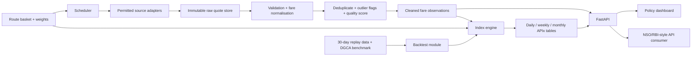

# Architecture Overview — Aero-Metrics (APIx)

## 1. System Architecture

APIx is designed as a governed, policy-grade statistical measurement system that turns volatile online airfares into transparent CPI-compatible price indices.

## 2. Core Components

1. **Collectors (`packages/collectors/`, `packages/collector-core/`)**
   - Scheduled sampling protocol (09:00 & 18:00 IST).
   - Strict rate-limiting, domain concurrency limits, robots compliance.
   - Deterministic replay adapter for reproducible offline judging.

2. **Data Pipeline (`packages/pipeline/`)**
   - Ingestion of raw responses to immutable store (Postgres + MinIO).
   - Validation: base fare, taxes, convenience fees, mandatory total fare.
   - Outlier detection (route × horizon × day MAD/IQR), deduplication, and quality scoring.

3. **Index Engine (`packages/index-engine/`)**
   - Computes route-horizon daily medians: $P(r,h,t)$.
   - Horizon weighting vector: $RouteIndex(r,t) = 100 \times \sum_h [v(h) \times R(r,h,t)]$.
   - Headline aggregation: $APIx(t) = \sum_r [w(r) \times RouteIndex(r,t)]$.
   - Imputation hierarchy (max 2 days carry-forward, then re-normalisation).

4. **API & Dashboard (`apps/api/`, `apps/dashboard/`)**
   - FastAPI microservice exposing statistical endpoints and OpenAPI documentation.
   - Next.js dashboard featuring executive overview, route heatmap, lead-time curves, fare decomposition, and data governance panel.

